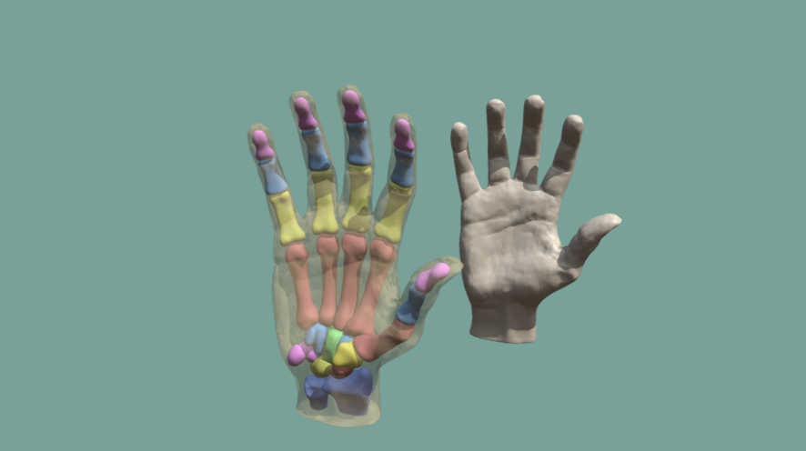
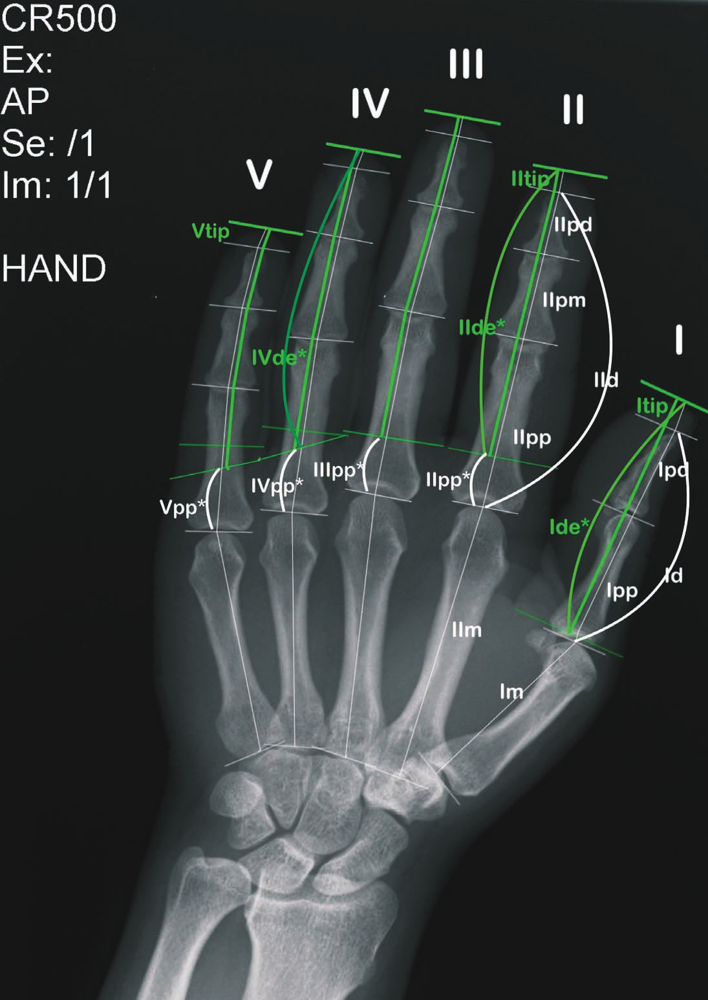

3D Hand
=======
This is a minimal 3D model for visualizing sign language hand shapes. In the
future I hope to include a more polished version of in my [Swedish Sign
Language Lexicon][lexicon] and [transcription] tools.

References
==========
[Buryanov & Kotiuk (2010)]: pdf/buryanov+kotiuk-2010-proportions_of_hand_segments.pdf
Buryanov, Alexander & Kotiuk, Viktor. (2010). “[Proportions of hand
segments][Buryanov & Kotiuk (2010)]”. Int. J. Morphol., 28* (3): pp. 755–758
https://scielo.conicyt.cl/pdf/ijmorphol/v28n3/art15.pdf

[Toomey (2022)]: https://sketchfab.com/3d-models/bones-of-the-hand-turntable-cd8e31d740824d6b93791d52d53be525
Toomey, Pearse. (2022). “[Bones of the Hand - Turntable][Toomey (2022)]”. 3D model.

[lexicon]: https://zrajm.org/teckentranskription/lexicon.html

[transcription]: https://zrajm.org/teckentranskription/

<!--[eof]-->
